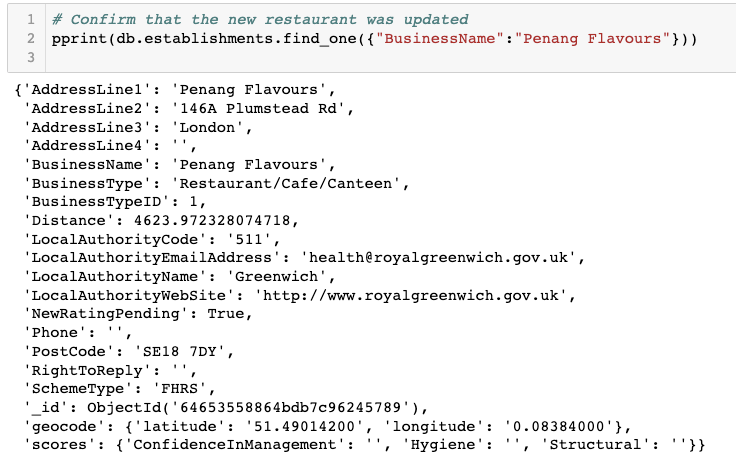
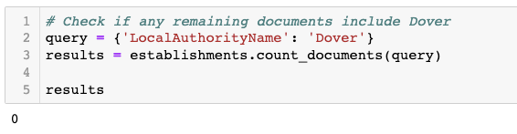
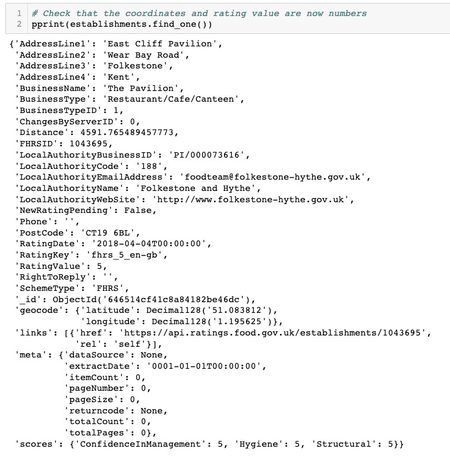
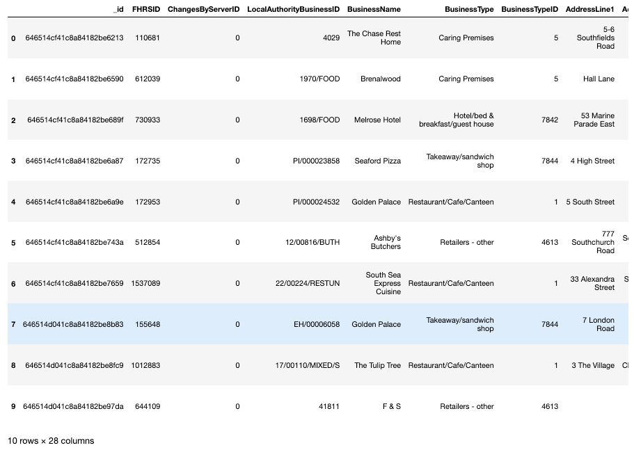
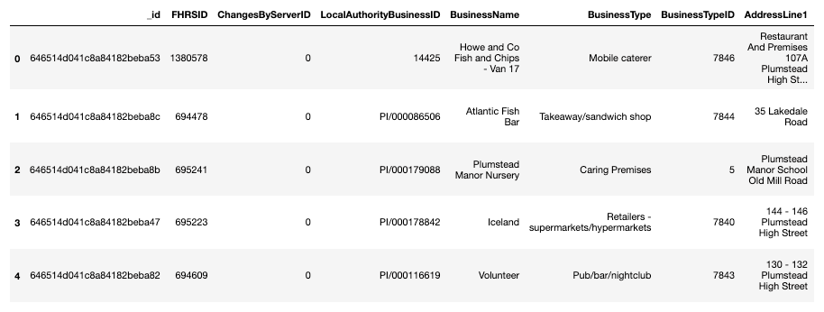
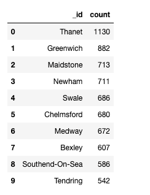

# nosql-challenge
Module 12 challenge

### Background
The UK Food Standards Agency evaluates various establishments across the United Kingdom, and gives them a food hygiene rating. You've been contracted by the editors of a food magazine, Eat Safe, Love, to evaluate some of the ratings data in order to help their journalists and food critics decide where to focus future articles.

### Part 1: Database and Jupyter Notebook Set Up
See "NoSQL_setup.ipynb" file for commented code.
[NoSQL_setup](NoSQL_setup.ipynb)

* Imported the data provided in the establishments.json file from the Terminal. Imported the dataset with the following:

    mongoimport --type json -d uk_food -c establishments --drop --jsonArray establishments.json

* Database name is uk_food and the collection name is establishments.

### Part 2: Update the Database
See "NoSQL_analysis.ipynb" file for Part 2 & Part 3 commented code.
[NoSQL_analysis](NoSQL_analysis.ipynb)

* An exciting new halal restaurant just opened in Greenwich, but hasn't been rated yet. The magazine has asked you to include it in your analysis. Added the restaurant "Penang Flavours" to the database. Updated the new restaurant with the correct BusinessTypeID.

* The magazine is not interested in any establishments in Dover, so check how many documents contain the Dover Local Authority. Then, remove any establishments within the Dover Local Authority from the database, and check the number of documents to ensure they were deleted.
Removed establishments in Dover.

    

* Converted latitude and longitude from string to decimal numbers. Converted Rating Value from string to integer numbers.

### Part 3: Exploratory Analysis
Eat Safe, Love has specific questions they want you to answer, which will help them find the locations they wish to visit and avoid.

#### Findings
* Establishments with a hygiene score equal to 20. (First 10 rows.)

* Establishments in London with a RatingValue greater than or equal to 4. (First 10 rows.)

* The top 5 establishments with a RatingValue of 5, sorted by lowest hygiene score, nearest to the new restaurant added, "Penang Flavours".

* Number of establishments in each Local Authority area with a hygiene score of 0. Results sorted from highest to lowest, and the top ten local authority areas are listed. 

    